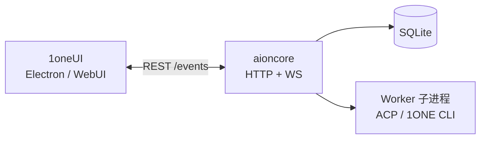

<h1 align="center">1oneCore</h1>

<p align="center">
  <strong>1ONE Code 本地后端 · Rust · 单二进制 <code>aioncore</code></strong><br>
  <em>会话、助手、Agent 探测、MCP、渠道、定时任务与企业 API 的统一运行时</em>
</p>

<p align="center">
  
  &nbsp;
  
  &nbsp;
  
  &nbsp;
  
</p>

<p align="center">
  前端仓库：<a href="https://github.com/gaogg521/1oneUI">gaogg521/1oneUI</a>（<strong>1ONE Code</strong> 桌面）
  &nbsp;·&nbsp;
  <a href="https://1one.1oneclaw.com">官网</a>
  &nbsp;·&nbsp;
  <a href="https://github.com/gaogg521/1oneUI/blob/one-main/docs/guides/fork-dev-onboarding.zh-CN.md">开发者上手指南</a>
</p>

---

## 这是什么

**1oneCore**（GitHub：`gaogg521/1oneCore`）是 [1ONE Code](https://github.com/gaogg521/1oneUI) 的**本地后端服务**。编译产物为单个可执行文件：

| 平台 | 二进制名 |
|---|---|
| Windows | `aioncore.exe` |
| macOS / Linux | `aioncore` |

[1oneUI](https://github.com/gaogg521/1oneUI) 桌面版启动时自动 spawn 该进程；WebUI 模式通过 HTTP API + WebSocket 连接同一实例。用户通常**只安装桌面包**，无需单独下载本仓库——本仓库面向**继续开发后端**的工程师。

---

## 提供什么能力

与上游 Cowork 后端能力对齐，并在本 fork 中扩展 `one-*` 企业模块：

| 域 | 说明 |
|---|---|
| **会话与消息** | SQLite 持久化、流式输出、工作区文件变更 |
| **助手** | 官方/自定义助手、Skills、生成型 CLI 助手探测 |
| **Agent 运行时** | 内置 **1ONE CLI**（`aionrs`）、ACP 子进程（Claude/Codex/Cursor…）、可用性扫描 |
| **MCP** | 服务端注册、工具调用、与助手绑定 |
| **渠道** | Telegram、飞书、钉钉、微信等 Bot 接入 |
| **Cron** | 定时任务调度与 Keep-awake |
| **Team** | 多 Agent 编队（Leader / Teammate） |
| **扩展** | Extension 生命周期与沙箱 |
| **dream-domain-org** | 项目组、租户、成员与角色、邀请码、组织架构、审计日志、备份恢复 |
| **dream-domain-enterprise** | 企业层（跨项目组治理、企业成员与席位） |
| **dream-domain-sso** | LDAP、飞书 / 钉钉 / 企业微信、标准 OIDC（Okta / Azure AD / Google） |
| **dream-domain-billing** | 授权许可离线激活、三档订阅与席位、功能门控、模型成本管控与用量 |
| **dream-domain-employee** | 数字员工（专家人设 + 后端 + 模型绑定）、协作看板 API |
| **dream-domain-devops** | 需求树、里程碑、RAG 混合检索知识库、派活、测试计划域 |
| **dream-domain-platform** | 容器化运行时、实时协作后端等平台级预留适配器 |

---

## 仓库结构

```text
crates/
├── dream-core-app/          # 二进制入口 → aioncore
├── dream-core-db/           # SQLite + migrations/
├── dream-core-ai-agent/     # Agent 注册、ACP、探测
├── dream-core-conversation/
├── dream-core-assistant/
├── dream-core-channel/
├── dream-core-cron/
├── dream-core-mcp/
├── dream-core-team/
├── dream-domain-org/             # 1ONE fork 扩展：项目组
├── dream-domain-enterprise/      #   企业层
├── dream-domain-sso/             #   SSO（含 OIDC）
├── dream-domain-billing/         #   授权 / 订阅 / 席位 / 模型管控
├── dream-domain-employee/        #   数字员工
├── dream-domain-devops/          #   需求 / 知识库 / 流水线
└── dream-domain-platform/        #   平台级预留适配器
```

数据库迁移位于 `crates/dream-core-db/migrations/`；应用启动时自动执行。

---

## 架构位置



- **不要**在 UI 进程里直接访问 DB——一律走 API  
- 主进程禁止滥用 `console`（由前端 Electron 侧约束）；后端用 `tracing` 日志  

---

## 快速开始（开发者）

### 前置

- Rust stable + Cargo  
- Windows：MSVC 构建工具  

### 克隆

```powershell
git clone -b one-main https://github.com/gaogg521/1oneCore.git
git clone -b one-main https://github.com/gaogg521/1oneUI.git
```

推荐与前端并列：

```text
aionui-m0/
├── 1oneCore/    ← 本仓库
└── 1oneUI/
```

### 编译

```powershell
cd 1oneCore
cargo build -p dream-core-app --release
# 产物：target\release\aioncore.exe
```

### 让前端用上刚编译的后端

```powershell
cd ..\AionUi
$env:AIONUI_BACKEND_LOCAL_PATH = '..\1oneCore\target\release\aioncore.exe'
node scripts/prepareAioncore.js
cd ..
# 然后在前端目录 bun run dev
```

或使用工作区脚本（若已配置）：`backend-rebuild.ps1` → `frontend-dev.ps1`  
详见 [AionUi 开发者指南](https://github.com/gaogg521/1oneUI/blob/one-main/docs/guides/fork-dev-onboarding.zh-CN.md)。

### 仅跑后端 API（不启桌面）

```powershell
.\target\release\aioncore.exe --local
# 默认端口见启动日志；可用 curl 测 /health
```

---

## 常用命令

| 命令 | 说明 |
|---|---|
| `cargo build -p dream-core-app --release` | 发布构建 |
| `cargo test -p dream-core-db` | 单 crate 测试 |
| `cargo clippy -p dream-core-app -- -D warnings` | Lint（CI 同等严格度视项目配置） |

改 `migrations/*.sql` 后**必须**重新编译并让 1oneUI bundled 目录更新，否则桌面仍跑旧 schema。

---

## 与上游的关系

本仓库由 Cowork 生态的 AionCore 演进而来，在 `one-main` 分支维护 **1ONE** 定制（`one-*` crates、1ONE CLI 品牌、企业/DevOps 等）。  

- **用户安装包**：只下 [AionUi Releases](https://github.com/gaogg521/1oneUI/releases)  
- **后端单独发布**：当前随桌面包 bundled；独立发版策略见团队文档  

---

## 文档

| 链接 | 内容 |
|---|---|
| [1oneUI readme](https://github.com/gaogg521/1oneUI/blob/one-main/readme.md) | 产品能力、对比表、用户上手 |
| [fork-dev-onboarding](https://github.com/gaogg521/1oneUI/blob/one-main/docs/guides/fork-dev-onboarding.zh-CN.md) | 双仓库 dev / 打包 |
| [repository-independence](https://github.com/gaogg521/1oneUI/blob/one-main/docs/guides/repository-independence.zh-CN.md) | 脱离上游 fork 网络 |

---

## 参与贡献

- 后端 Issue：[gaogg521/1oneCore](https://github.com/gaogg521/1oneCore/issues)  
- 界面 Issue：[gaogg521/1oneUI](https://github.com/gaogg521/1oneUI/issues)  
- 官网：[1one.1oneclaw.com](https://1one.1oneclaw.com)

<p align="center">
  <sub>Part of <strong>1ONE Code</strong> · <a href="https://github.com/gaogg521">gaogg521</a> · Apache-2.0</sub>
</p>
