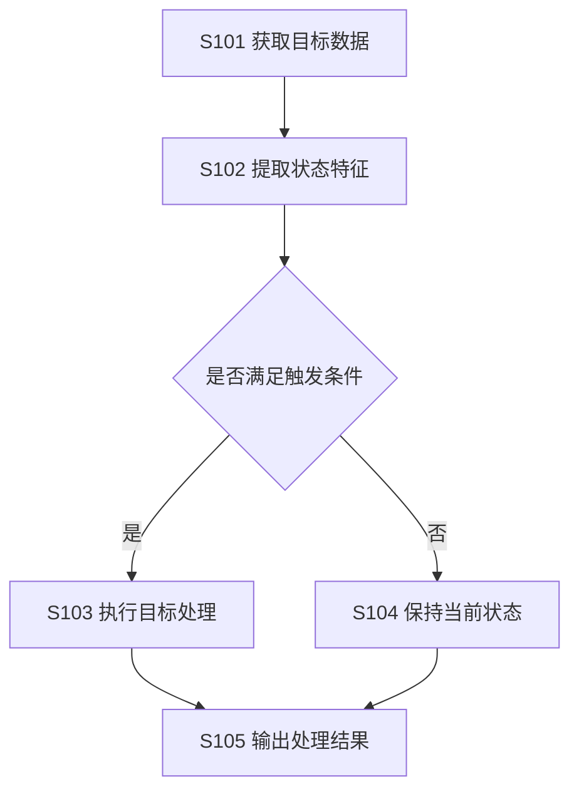

# 专利交底可视化规范

仅在图形能显著提升结构、顺序或对比理解时读取。默认优先清晰和兼容，不追求装饰效果。

## 选择图形

| 信息关系 | 推荐形式 |
|---|---|
| 组件、部署、连接关系 | Mermaid `flowchart` 结构图 |
| 有先后、分支、回路的步骤 | Mermaid `flowchart` 流程图 |
| 多主体按时间交互 | Mermaid `sequenceDiagram` |
| 状态迁移 | Mermaid `stateDiagram-v2` |
| 独立评分、候选方案比较 | Markdown 表格或文本条形图 |
| 核心专利与外围主题层级 | Mermaid `flowchart` 层级图 |

评分不应使用没有语义连接的流程图。能用一张表讲清楚时不要生成图。

## Mermaid 兼容规则

- 节点 ID 使用 ASCII，如 `S101`、`ModuleA`；显示文字可用中文并放在引号中。
- 避免 HTML 标签、CSS 渐变、阴影、`div`、复杂内联样式和依赖特定渲染器的图标。
- 连线文字简短，复杂条件放在正文解释。
- 每张图表达一个中心关系；超过约 12 个节点时拆图。
- 图中步骤编号、组件名、数据名与正文完全一致。
- 自主补充但尚待验证的关系可用虚线，并在图下注明“建议机制/待验证”，不要把未验证关系画成既有事实。

## 流程图示例

正文应解释触发条件、特征来源、目标处理和输出，不让图代替充分公开。

## 结构图示例

## 评分条示例

独立评分用表格加简洁文本条，避免星级制造虚假精度：

| 维度 | 分数 | 证据摘要 |
|---|---:|---|
| 差异清晰度 | 4/5 | 已识别两个相互作用的区别特征 |
| 可实施支持 | 3/5 | 主流程完整，边界参数待补 |

`差异清晰度  ████░  4/5`

## 附图自检

- 图是否对应正文中真实存在的方案？
- 每条边是否表示明确的数据、控制、物理连接或时序关系？
- 是否遗漏关键分支、反馈或异常路径？
- 是否把备选方案误画成核心实施例？
- 图名、编号、节点和正文引用是否一一对应？
